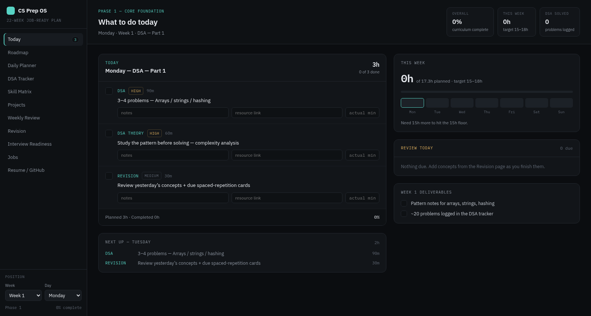
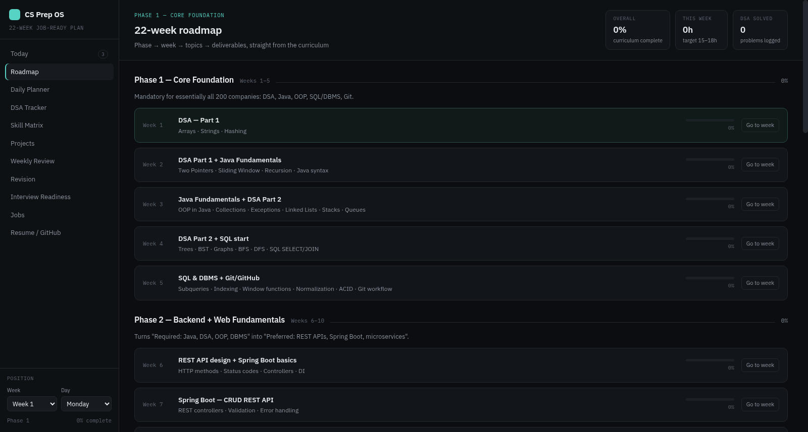
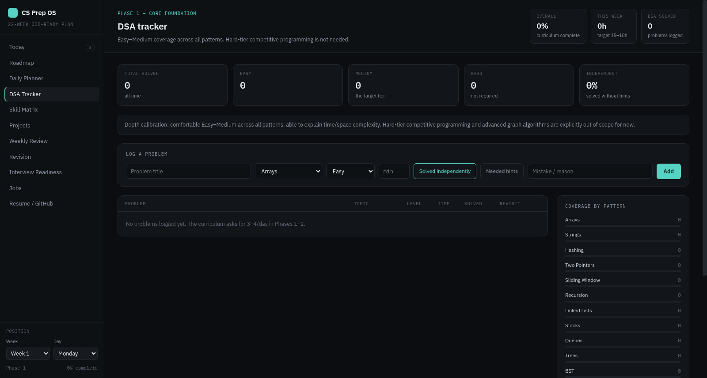
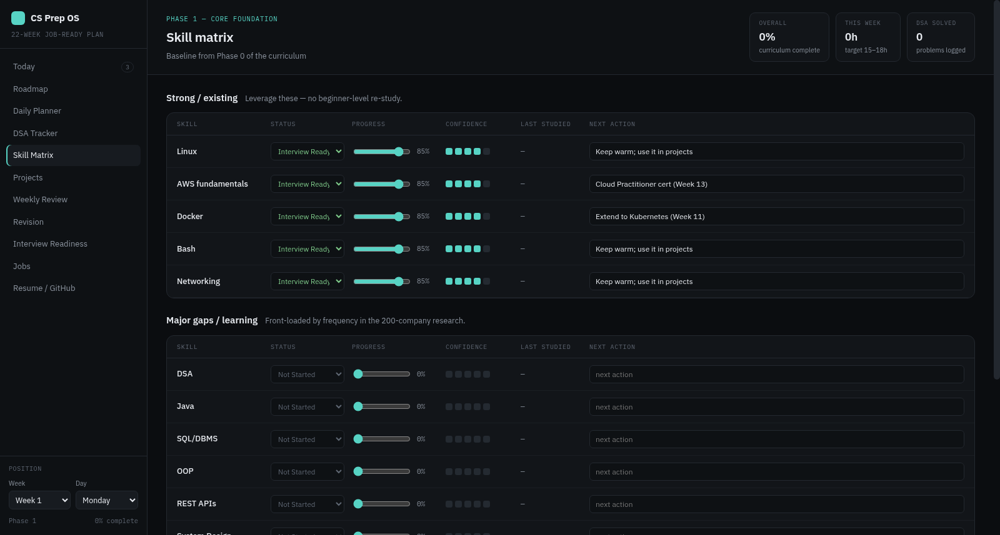

# CS Prep OS

A personal 22-week CS job-preparation dashboard built with Claude Design. Tracks everything in one place — daily tasks, DSA problems, skills, projects, and job applications — tailored for a Cloud/DevOps-background engineer targeting backend/SDE roles.


---

## Screenshots

| Today | Roadmap |
|---|---|
|  |  |

| DSA Tracker | Skill Matrix |
|---|---|
|  |  |

---

## What it tracks

| Section | What it does |
|---|---|
| **Today** | Daily task list, DSA problem log, spaced-repetition revision cards, reflection notes |
| **Week** | Weekly schedule with study blocks, time tracking, deliverables checklist |
| **DSA Tracker** | Log problems by topic/difficulty; coverage stats across 18 patterns |
| **Skills** | Status, progress %, and confidence rating for every skill (strong areas + gaps) |
| **Projects** | Portfolio project pipeline — Java → Spring Boot → Docker → K8s → AWS → Terraform |
| **Jobs** | Application tracker with statuses: Saved, Applied, OA, Interview, Offer, Rejected |
| **Roadmap** | 5-phase plan overview + secondary track selector |
| **Checklist** | Resume and GitHub readiness checklist |
| **Rules** | 12 self-imposed study constraints to stay focused |

---

## The 5-phase curriculum

| Phase | Weeks | Focus |
|---|---|---|
| 1 | 1–5 | DSA, Java, OOP, SQL/DBMS, Git |
| 2 | 6–10 | Spring Boot, REST APIs, Backend, System Design basics |
| 3 | 11–15 | Kubernetes, CI/CD, AWS cert, Microservices, Terraform |
| 4 | 16–18 | Interview-intensity DSA, LLD, mock interviews |
| 5 | 19–22 | Optional track: Full-Stack / AI-ML / QA / Cybersecurity |

---

## Running locally

### Windows

**Double-click `Start Dashboard.bat`** — it starts a local server and opens the dashboard in your browser automatically.

Requires **Python** (recommended) or **Node.js**:
- Python: [python.org/downloads](https://www.python.org/downloads/) — check "Add to PATH"
- Node.js: [nodejs.org](https://nodejs.org/)

The dashboard runs at `http://localhost:8765`.

### Linux

**From a terminal:**

```bash
./start-dashboard.sh
```

This opens `CS Prep OS.dc.html` directly in your default browser.

**From a file manager (GNOME/Nautilus and similar):** double-clicking `.sh` files usually won't run them — most file managers open scripts in a text editor instead, or block execution outright for security. Instead, install the included app launcher so the dashboard shows up like any other app:

```bash
mkdir -p ~/.local/share/applications
cp "Start Dashboard.desktop" ~/.local/share/applications/cs-prep-os.desktop
update-desktop-database ~/.local/share/applications
```

Then open your app launcher (Activities/search, rofi, wofi, etc.) and search for **"CS Prep OS Dashboard"**.

> Note: `Start Dashboard.desktop`'s `Exec` line uses an absolute path. If you clone this repo somewhere other than its current location, edit that line to match your local path before installing the launcher.

All data is saved to `localStorage` — nothing is lost between sessions.

---

## Files

```
CS Prep OS.dc.html      — main dashboard (all logic + data)
support.js              — Claude Design runtime (React renderer)
index.html              — redirect shim for clean URL
Start Dashboard.bat     — one-click launcher for Windows
start-dashboard.sh      — one-click launcher for Linux (terminal)
Start Dashboard.desktop — app launcher for Linux (file manager / app search)
screenshots/            — dashboard screenshots used in this README
```

---

## Tech

- **UI:** React 18 (loaded from CDN), rendered via Claude Design's dc-runtime
- **Persistence:** `localStorage` under key `csprepos.v1`
- **Fonts:** IBM Plex Sans + IBM Plex Mono (Google Fonts)
- **No build step** — open the HTML file and it works
